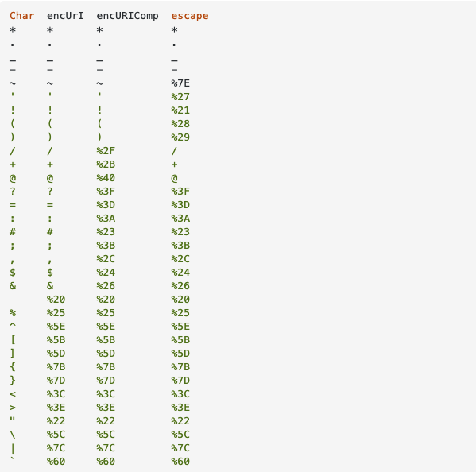

what where when how

## 当我们在讲字符编码时，我们在讲什么
我们知道，计算机只认识由0和1组成的二进制数字，我们自然世界中的文字，需要根据某种方式，编码成一串二进制位串，计算机才能正确识别并显示，这个编码的过程就称之为**字符编码**；

那么字符编码的过程是怎么样的呢？首先我们先回顾一下基本概念：
  * 位（b）：也称比特，是数据存储的最小单位，在计算机的二进制系统中，每一个0或1就是一个位；
  * 字节（byte)：是计算机中用于计量存储容量的一种计量单位，1byte = 8bit;

## 字符集
字符集是部分已定义编号的字符的集合；比如ASCII字符集；

### ASCII字符集
ASCII码使用一个字节来表示一个字符，一个字节有8位，第一位是扩展位，都是0，后七位是实际编号，共能表示128个符号；

这个时候的字符编码非常简单，字符序列的编号就是编码，中间不需要特别的编码算法进行从字符编号到字符编码的转换；

### GBK系列

但是随着计算机的发展，各个地区都用上了计算机，每个地区都有自己的语言系统，就比如中文的汉字，用满满一个字节`2^8 = 256`来表示都不够用，所以只能使用多个字节来表示一个字符；

于是unicode字符集出现了，并且定义了UTF-8、UTF-16、UTF-32三种编码方式，其中UTF-8是现在使用最为广泛的，大有一统天下之意；

### Unicode

unicode字符集最大的优势在于，它解耦了字符编码和编码模型之间的联系；像之前的字符集，字符集中的编号即编码；
unicode字符集只定义了字符的编号，但是你可以选择不同的编码方式对它进行编码；同时，它向下兼容ASCII字符集；

#### UTF-8
UTF-8是一种编码方式，8位为一个字节，UTF-8就是单字节编码方式，在unicode中，以0开头的单字节依旧表示ASCII字符，对于非ASCII字符，以双字节、三字节甚至四字节表示一个字符；那么UTF-8是如何判断一个字符的字节流的开始与结束的呢？如果字节的首位是1，那一定是多字节字符，下面需要判断它是首位字节还是后续字节；首位字节有表示是几个字节的前缀位，即以0标志前缀位的结束，

```
字节首位
0 -> ASCII字符
10 -> 多字节字符的后续字符
110 ->  双字节字符的首字符
1110 -> 三字节字符的首字符
... // 以此类推，后面还可以扩展四字节、五字节、六字节
```

UTF-8是单字节、变长的编码方式，单字节指的是以单字节的方式输出字节流，但是多个字节流也可以表示一个字符，UTF-8这种编码方式，节省了空间，但是编码算法上需要消耗点时间；


#### UTF-32
UTF-32很好理解，它是一种多字节、等长的编码方式，即所有字符都用4字节表示，即使只占用一个字节的ASCII字符，通过前面补三个字节的0来表示；这样无疑是很浪费空间的，但是不需要任何编码算法，编号即编码；


#### UTF-16
UTF-16是双字节、变长的编码方式；它采用双字节表示字符，但是对于一些多字节，需要用三个字节，四个字节才能表示完的字符，仍然要采用算法来判断；UTF-16是Unicode最早推出的一种编码方式；

#### Javascirpt的编码方法

`Javascirpt`采用`unicode`字符集，编码方法使用的却是`UCS-2`，由于历史原因，在`Javascript`发行的时候`UTF-16`还未面世；

因此，`Javascript`会将`unicode`字符集中需要三字节、四字节表示的字符识别为两个字符；


### Base64
> From wiki: " Base64 encoding schemes are commonly used when there is a need to encode binary data that needs be stored and transferred over media that are designed to deal with textual data. This is to ensure that the data remains intact without modification during transport ".

按照`wiki`上的解释，`Base64`用于对任意的二进制数据进行编码，以保证数据在存储或者传输过程中的完整性；
因为有些媒体只接收`textual data`（文本数据）,例如`FTP`;

ASCII码中的字符分两类，一类是可打印字符，编号为32～126的字符均为可打印字符，另一类是非可打印控制字符，编号为0～31；一些媒体只能在接收数据时会将二进制串的非可打印控制字符过滤掉，只识别可打印字符，这样就在网络传输中损坏原数据；`Base64`编码表包含64个字符，分别是A-Z,a-z,0-9,+,/, 用6bit表示一个字符；而ACSII字符是用8bit来表示一个字符，因此，4个base64字符可以表示3个ASCII字符，但同时base64字符串也会比原字符串多占33%的空间；

在用base64对一段数据进行编码时，首先要把数据转成二进制串，然后从左向右每六位编码成一个base64字符，最后不足六位的补`0`，不足三位的补`=`；最后在解码时，多数base64解码会把最后的`=`去掉；

### url encode & url component encode
在`javascript`中，经常分不清楚`encodeURI` 和 `encodeURIComponent`的用法；

其实，所有的`encode`都是为了方便数据传输和解析而定义的；因为URI有固定的规则，用`/`作为路径分隔符，如果路径名称包含`/`就会有歧义；所以`encodeURI`和`encodeURIComponent`就是用来给URI中存在的特殊字符编码的；

不同的是，`encodeURI`是针对URI中不允许存在的字符进行编码，例如`/`、`[`、`]`、`%`等等；`encodeURIComponent`不仅针对URI中不允许存在的字符，还针对在URI中有特殊意义的字符进行编码；

如果用数学关系表示的话，`encodeURIComponent` 可编码的特殊字符包含 `encodeURI` 可编码的特殊字符；

*附：url encode 编码表*


*附：base64编码表*

##### 参考文章
[刨根究底学编程](https://www.zhihu.com/column/paogenjiudi)
